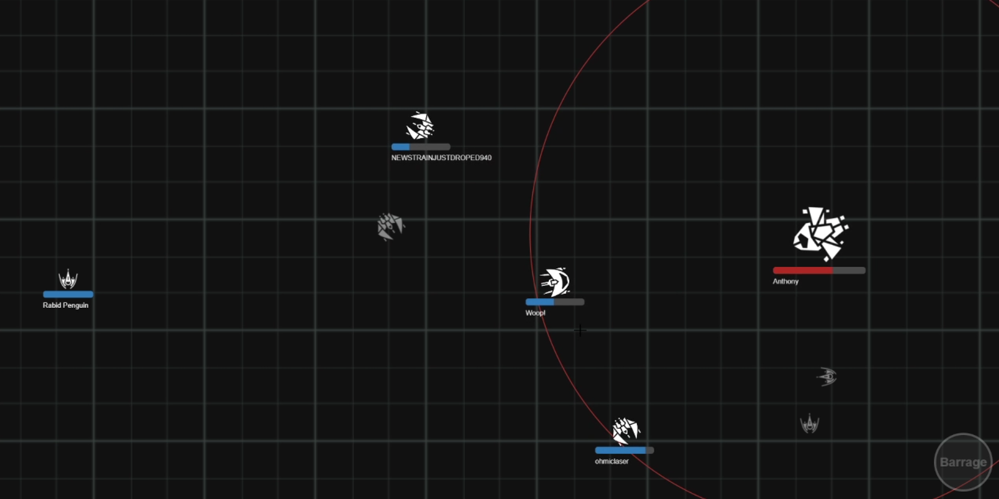
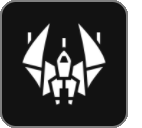
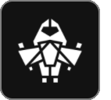
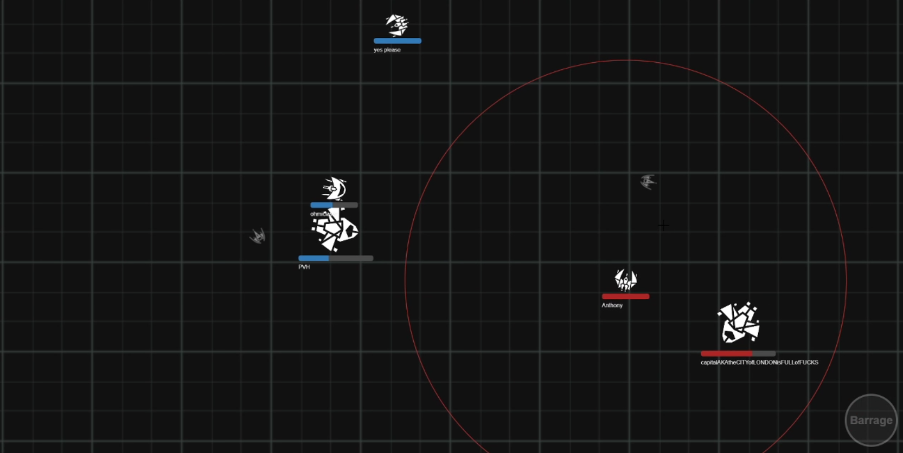

# Pew Pew

 

Coordinate with your team in a multiplayer space-shooter.

**Global Game Jam 2021**\
**Theme**: "Lost and Found"

## Scout

Fast-moving with rapid-fire lasers.

> ***Tip:** Use your range to kite and outrange **battleships**.*

> ***Tip:** Two **scouts** will make short-work of a **gunship** when they cordinate their attack.*

> ***Tip:** Use your speed to take a few hits and safely retreat to the back lines until your needed again.*

**Damage:**\
\
**Range:**\
\
**Speed:**\
\

## Gunship

Long-ranged, slow-moving ship with a high-damage torpedo ability.

***Barrage***:  Fire a singular high-damage torpedo at the target destination.

> ***Tip:** Stay out of the range of your enemies and rain-down fire from a distance.*

> ***Tip:** Wait for reinforcements before engaging a **capital ship**.*

**Damage:**\
\
**Range:**\
\
**Speed:**\
\

## Battleship

Durable, slow-moving with close-range lasers.

***Barrage***: Fire a spray of low-damage torpedos towards the target location.

> ***Tip:** Charge the enemy to absorbe fire for your **gunships** and **scouts**.*

**Damage:**\
\
**Range:**\
\
**Speed:**\
\

## Capital

Durable ship with game-changing firepower in bursts

***Barrage***: Fire a spray of high-damage torpedos towards the target location.

> ***Tip:** Use the barrage ability button at the bottom-right of your screen to deliver a stream of high-damage torpedoes.*

> ***Tip:** Use your presense to control the flow of the battle.*

**Damage:**\
\
**Range:**\
\
**Speed:**\
\

## Installation

To run a game server:

- Install .NET 5.0 SDK
- Compile (or obtain) the server binaries
- Navigate to the binary directory
- Run `dotnet PewPew.WebApp.Server.dll`

## Credits

**[Anthony Marmont](https://github.com/Fydar):** Programmer

## License

This work is licensed under a [Creative Commons Attribution-NonCommercial 4.0 International License](http://creativecommons.org/licenses/by-nc/4.0/).
